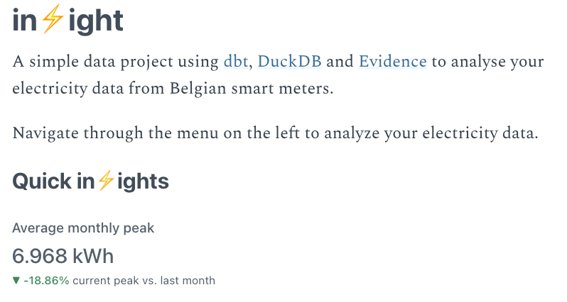

# in⚡️ight

A simple data project using [dbt](https://getdbt.com), [DuckDB](https://duckdb.org/) and [Evidence](https://evidence.dev/) to analyse your electricity data from Belgian smart meters.

Thanks to [Jacob Matson](https://github.com/matsonj) for [his blog post](https://www.dataduel.co/modern-data-stack-in-a-box-with-duckdb/) that inspired all of this.

## Available in⚡️ights

### Available models & documentation

The dbt documentation is available at [https://sdebruyn.github.io/inzight](https://sdebruyn.github.io/inzight).

### Included dashboards




### Requirements

* Python 3.8 or newer (dbt & DuckDB)
* NPM 7 or newer and Node.JS 14 or newer (Evidence)
* Your source data (see below)

### Setup

1. Clone the repo: `git clone https://github.com/sdebruyn/inzight.git`
1. Install the dependencies:
    ```bash
    pip install -r requirements.txt
    npm install
    ```
1. Create a profile named `inzight` in `~/.dbt/profiles.yml` with the following content:

    ```yaml
    inzight:
      target: dev
      outputs:
        dev:
          type: duckdb
          threads: 12 # should be the number of cores in your system (or double if you have hyperthreading)
          database: /path_to_the_project/inzight.duckdb # point to the project folder
    ```

### Source data

The project expects an export from *Mijn Fluvius* with *Kwartierwaarden*. The export should go in `assets/fluvius.csv`.

My column names are in Dutch, I have no idea what you get if you have a different language setting for Fluvius. Please create an issue with your column names if yours are not in Dutch.

### Analyzing

1. Make sure your source data has been added as a file named `assets/fluvius.csv`
1. Run `dbt deps` to install the dbt package dependencies
1. Run `dbt build` to create all models
1. Run `npm run dev` to start the Evidence server and open the dashboards in your browser

## Note

It's (like most hobby projects) a never-ending work in progress. Contributions are welcome!

## License

MIT License
